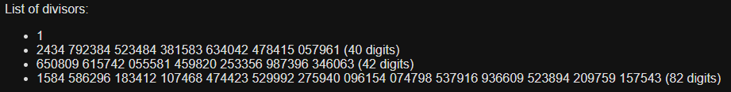
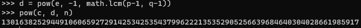

# Mind Your P's and Q's

[The challenge](https://play.picoctf.org/practice/challenge/162):
```
Decrypt my super sick RSA:
c: 964354128913912393938480857590969826308054462950561875638492039363373779803642185  
n: 1584586296183412107468474423529992275940096154074798537916936609523894209759157543
e: 65537
```

The [Wikipedia page on RSA](https://en.wikipedia.org/wiki/RSA_(cryptosystem)#Integer_factorization_and_RSA_problem) claimed:
> If n is 300 bits or shorter, it can be factored in a few hours in a personal computer, using software already freely available.  

So I found [this handy dandy website](https://www.alpertron.com.ar/ECM.HTM) which let me find the factors $p$ and $q$ of $n$ (only took 15 min!):


Knowing these, I simply found $d$ in python and decrypted $c$.


 <details> <summary> Finally, I converted to hex and decoded to get the flag </summary> picoCTF{sma11_N_n0_g0od_73918962} </details> 